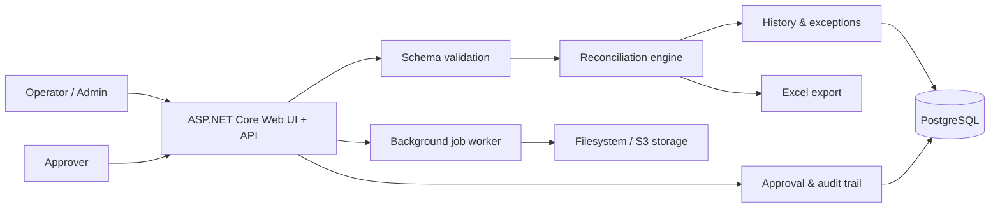

# Banking Reconciliation

[](https://github.com/Muhametaydn/BankingReconciliation/actions/workflows/ci.yml)

[English](README.md) | [Türkçe](README.tr.md)

Production-minded reconciliation platform for comparing branch and bank
transactions, investigating exceptions, and recording an approval decision with
an auditable trail.

Built as a portfolio project to demonstrate backend engineering beyond a basic
CRUD application: configurable validation, secure role-based workflows,
asynchronous processing, persistence, operational controls, and deployment
automation.

## Highlights

- Upload and reconcile CSV, delimited TXT, fixed-width TXT, or configured
  database-source records.
- Detect missing transactions, duplicate keys, quantity/amount mismatches, and
  differences in configurable numeric fields.
- Configure file schema, matching keys, comparison fields, mappings, and result
  fields at runtime; changes are validated and audited.
- Use local JWT authentication with **Administrator**, **Operator**, and
  **Approver** roles. Completed batches require an Approver decision.
- Store history, exceptions, settings, approval decisions, and audit events in
  PostgreSQL; use in-memory storage only for local fallback.
- Run large comparisons as recoverable background jobs with bounded retries and
  lease-based processing.
- Export differences to Excel and browse/filter paginated reconciliation history.
- Support local filesystem, shared filesystem, and S3-compatible temporary
  storage, including MinIO integration testing.
- Include Docker, Kubernetes, backup/restore, OpenTelemetry, security-header,
  rate-limit, and deployment verification contracts.

## Architecture



## Tech Stack

| Area | Technologies |
| --- | --- |
| Backend | .NET 8, ASP.NET Core Minimal APIs, EF Core |
| Data | PostgreSQL, Npgsql, EF Core migrations |
| Security | JWT bearer authentication, role/permission policies, audit trail, rate limiting, security headers |
| Storage | Local/shared filesystem, AWS S3-compatible storage, MinIO |
| Operations | Docker, Kubernetes, OpenTelemetry, PowerShell deployment/verification scripts |
| Quality | xUnit, GitHub Actions, formatting checks, integration-test profiles |

## Run Locally

Prerequisite: .NET SDK 8.

```powershell
git clone https://github.com/Muhametaydn/BankingReconciliation.git
cd BankingReconciliation
dotnet run --project .\BankingReconciliation.Api\BankingReconciliation.Api.csproj
```

Open `http://localhost:5230`. On an empty local installation, create the first
account from **Kayıt ol**; it is automatically the Administrator. Additional
accounts start as Operators and can be assigned the Approver role by an
Administrator.

Sample files are available in
[`BankingReconciliation.Api/Samples`](BankingReconciliation.Api/Samples).

### Run with Docker

```powershell
docker build -t banking-reconciliation:local .
docker run --rm -p 8080:8080 banking-reconciliation:local
```

Open `http://localhost:8080`.

## Verify

```powershell
dotnet test .\BankingReconciliation.sln --configuration Release
dotnet format .\BankingReconciliation.sln --verify-no-changes --no-restore
```

## Deployment Notes

The repository includes a Docker Desktop Kubernetes development profile:

```powershell
.\deploy\kubernetes\deploy-local.ps1
```

For deployment, backup, rollback, and staging verification instructions, see
[the Kubernetes runbook](deploy/kubernetes/README.md). The repository-level
production readiness boundary is documented in
[PRODUCTION_READINESS.md](PRODUCTION_READINESS.md): cloud identity, real secrets,
and production approval require environment-owner evidence and are intentionally
not represented as locally completed.

---

## Detailed Technical Reference

Production deployment, security, backup, staging, and rollback gates are tracked
in [PRODUCTION_READINESS.md](PRODUCTION_READINESS.md). The executable Kubernetes
runbook is under [deploy/kubernetes](deploy/kubernetes/README.md).

.NET 8 ASP.NET Core Web API project for comparing branch transaction records with bank transaction records.

The API accepts two CSV or TXT files that use the expected delimited transaction format:

- `branchFile`: branch/source-side transactions
- `bankFile`: bank/central-side transactions

Two transactions are treated as the same business transaction when these fields match:

```text
BranchCode + FundCode + TransactionNumber
```

If `Quantity` or `Amount` differs for the same transaction key, the result is reported as a mismatch.

## Project Structure

```text
BankingReconciliation.Api
  Contracts
  Endpoints
  Models
  Options
  Samples
  Services
  wwwroot

BankingReconciliation.Tests
  CsvTransactionFileParserTests.cs
  FrontendTests.cs
  ReconciliationEndpointTests.cs
  ReconciliationResponseMapperTests.cs
  ReconciliationServiceTests.cs
```

## File Format

The header must contain these columns:

```csv
BranchCode,FundCode,TransactionNumber,TransactionDate,Quantity,Amount
```

Supported delimiters:

- comma: `,`
- pipe: `|`
- tab

Example:

```csv
BranchCode,FundCode,TransactionNumber,TransactionDate,Quantity,Amount
BEYLIKDUZU,A,TX001,2026-06-26,100,10000
BEYLIKDUZU,B,TX002,2026-06-26,50,5000
```

TXT files can also use pipe-delimited format:

```text
BranchCode|FundCode|TransactionNumber|TransactionDate|Quantity|Amount
BEYLIKDUZU|A|TX001|2026-06-26|100|10000
```

Rules:

- `TransactionDate` must use `yyyy-MM-dd`.
- `Quantity` and `Amount` must be valid decimal numbers using invariant culture.
- `BranchCode`, `FundCode`, and `TransactionNumber` are required.
- Validation errors include the failing `rowNumber` and, when known, `columnName`.
- Parser validation is driven by a central fixed column schema for the current file format.
- Duplicate transaction keys in either file are rejected.
- Uploaded files must use an allowed extension. The default allowed extensions are `.csv` and `.txt`.
- Each uploaded file must be 5 MB or smaller.

The upload size limit is configured in `appsettings.json`:

```json
"ReconciliationUpload": {
  "MaxCsvFileSizeBytes": 5242880,
  "MaxRecordsPerFile": 100000,
  "BackgroundQueueCapacity": 100,
  "TemporaryStorageMode": "Local",
  "TemporaryStoragePath": "",
  "TemporaryFileRetentionHours": 24,
  "TemporaryFileCleanupIntervalMinutes": 60,
  "TemporaryFileCleanupBatchSize": 100,
  "S3BucketName": "",
  "S3Prefix": "banking-reconciliation/uploads",
  "S3Region": "us-east-1",
  "S3ServiceUrl": "",
  "S3ForcePathStyle": false,
  "S3ServerSideEncryption": "BucketDefault",
  "S3KmsKeyId": "",
  "S3ExpectedBucketOwner": "",
  "AllowedFileExtensions": [ ".csv", ".txt" ]
}
```

An empty `TemporaryStoragePath` in `Local` mode uses the operating system temporary directory. Background uploads are copied with generated batch-based names; client file names are retained only as sanitized display metadata.

For multiple application nodes, point every node at the same UNC path or mounted shared volume:

```json
"ReconciliationUpload": {
  "TemporaryStorageMode": "SharedFileSystem",
  "TemporaryStoragePath": "\\\\fileserver\\banking-reconciliation\\uploads"
}
```

`SharedFileSystem` requires an absolute path. The application creates one persistent, non-secret storage identity marker in that root. Every node using the same root reads the same identity; different local roots receive different identities. Each uploaded-file batch is bound to that identity in PostgreSQL, so a worker connected to another local or shared root cannot claim and fail a job whose files it cannot access. The marker must remain with the shared directory and must not be copied to an unrelated store.

AWS S3 uses the same job contract with an empty service URL:

```json
"ReconciliationUpload": {
  "TemporaryStorageMode": "S3Compatible",
  "S3BucketName": "banking-reconciliation-production",
  "S3Prefix": "banking-reconciliation/uploads",
  "S3Region": "eu-central-1",
  "S3ServiceUrl": "",
  "S3ForcePathStyle": false,
  "S3ServerSideEncryption": "BucketDefault",
  "S3KmsKeyId": "",
  "S3ExpectedBucketOwner": "123456789012"
}
```

MinIO uses its HTTP(S) endpoint and path-style addressing:

```json
"ReconciliationUpload": {
  "TemporaryStorageMode": "S3Compatible",
  "S3BucketName": "banking-reconciliation-production",
  "S3Prefix": "banking-reconciliation/uploads",
  "S3Region": "us-east-1",
  "S3ServiceUrl": "https://minio.internal.example",
  "S3ForcePathStyle": true,
  "S3ServerSideEncryption": "BucketDefault",
  "S3KmsKeyId": "",
  "S3ExpectedBucketOwner": ""
}
```

The bucket must already exist. Credentials are resolved by the AWS SDK credential chain; use workload/instance identity in AWS or the standard `AWS_ACCESS_KEY_ID`, `AWS_SECRET_ACCESS_KEY`, and optional `AWS_SESSION_TOKEN` environment variables. Do not place credentials in `appsettings.json` or in the service URL. The runtime needs object `Put`, `Get/Head`, `Delete`, and prefix-scoped `List` permissions.

`S3ServerSideEncryption` accepts three modes:

- `BucketDefault` sends no encryption override and relies on centrally managed bucket encryption.
- `AES256` requests provider-managed SSE-S3 for every upload.
- `AwsKms` requests AWS KMS encryption and requires a non-empty `S3KmsKeyId`.

`S3KmsKeyId` must be empty in the other two modes. On AWS, set
`S3ExpectedBucketOwner` to the 12-digit account ID so every bucket request
fails if DNS, configuration, or credentials resolve to an unexpected owner.
Leave it empty for MinIO unless that S3-compatible deployment explicitly
supports the AWS expected-owner header.

Production-ready starting templates are included for
[AWS S3](deploy/aws/README.md) and [MinIO](deploy/minio/README.md). They keep
application access limited to the configured prefix, separate administrative
lifecycle/encryption permissions from the runtime identity, and add a
provider-native cleanup safety net. Infrastructure lifecycle expiry is
independent of PostgreSQL job state, so its current-object expiry must remain
longer than the maximum outage and recovery window.

S3 object keys are generated as `{prefix}/{batch-id}/branch-upload.dat` and `{prefix}/{batch-id}/bank-upload.dat`; client file names never enter an object key. Incoming bytes are streamed into a bounded, delete-on-close file under the operating-system temporary directory. The actual-byte limit is enforced before the seekable staging file is uploaded with the SDK's checksum validation, so oversized requests do not create partial S3 objects. Production containers mount `/tmp` on an ephemeral writable volume. The storage affinity key is a deterministic hash of endpoint, region, bucket, and prefix. Changing any of those values requires draining or resubmitting queued uploaded-file jobs before restart.

Temporary-file lifecycle cleanup also runs on every application instance. Filesystem directories or S3 object groups older than `TemporaryFileRetentionHours` are scanned in bounded batches at `TemporaryFileCleanupIntervalMinutes`. Before deletion, PostgreSQL is queried for active `Queued` or `Processing` uploaded-file jobs on the same storage identity. Active and retry-waiting jobs are always protected; only expired orphan data and terminal-job leftovers are removed. Concurrent cleanup attempts are safe and failed deletions are retried by a later scan.

The S3 adapter uses `AWSSDK.S3` 4.0.101.3. A conditional real-provider integration test is enabled by `BANKING_RECONCILIATION_S3_TEST_BUCKET`; optional endpoint, region, and authorized root-prefix variables are `BANKING_RECONCILIATION_S3_TEST_SERVICE_URL`, `BANKING_RECONCILIATION_S3_TEST_REGION`, and `BANKING_RECONCILIATION_S3_TEST_PREFIX`. CI runs this profile against an ephemeral MinIO instance with `BANKING_RECONCILIATION_S3_TEST_REQUIRED=true`. It also sets `BANKING_RECONCILIATION_S3_TEST_ENFORCE_LEAST_PRIVILEGE=true` to verify that the application identity cannot write outside its prefix or read bucket lifecycle configuration.

The file schema can also be configured in `appsettings.json`.
The current reconciliation engine still expects these six transaction fields, but their header names, order, type metadata, date format, and UI descriptions are now read from configuration:

```json
"ReconciliationFileSchema": {
  "Columns": [
    {
      "Field": "BranchCode",
      "Name": "BranchCode",
      "Type": "Text",
      "Required": true,
      "Description": "Sube/kaynak kodu. Matching key parcasidir."
    },
    {
      "Field": "TransactionDate",
      "Name": "TransactionDate",
      "Type": "Date",
      "Required": true,
      "DateFormat": "yyyy-MM-dd",
      "Description": "Islem tarihi. yyyy-MM-dd formatinda olmalidir."
    },
    {
      "Field": "TransactionNumber",
      "Name": "TransactionNumber",
      "Type": "Text",
      "Required": true,
      "Pattern": "^[A-Za-z0-9-]+$",
      "PatternDescription": "Harf, rakam ve tire icerebilir.",
      "MinLength": 3,
      "MaxLength": 40,
      "MinValue": null,
      "MaxValue": null,
      "MaxDecimalPlaces": null,
      "AllowedValues": [ "TX001", "TX002" ],
      "Description": "Islem numarasi. Matching key parcasidir."
    }
  ]
}
```

`Field` is the internal transaction field. `Name` is the file header column expected in the uploaded file.
If the section is omitted, the app uses the default six-column schema.
Supported schema types are `Text`, `Date`, `Decimal`, and `Integer`.
Each required `Field` must appear exactly once. Header `Name` values must also be unique after trimming surrounding whitespace and ignoring letter case.
Columns can optionally define a regular expression `Pattern`, a user-facing `PatternDescription`, `MinLength` / `MaxLength`, `MinValue` / `MaxValue`, `MaxDecimalPlaces`, and `AllowedValues` rules to enforce field-level format rules from configuration.
The schema may also include extra fields beyond the required six fields. Extra fields are validated with the same rules, parsed into each transaction record's `extraFields`, and can be included in result `fieldValues` through `ResultFields`.

For fixed-width TXT, set `FixedWidthStart` (one-based) and `FixedWidthLength` on every schema column. Definitions must be complete, positive, non-overlapping, and wide enough for the configured header name. The first row remains the header and is read with the same fixed positions. If no fixed-width positions are configured, comma, pipe, and tab-delimited parsing continues unchanged.

```json
{
  "Field": "BranchCode",
  "Name": "BranchCode",
  "Type": "Text",
  "Required": true,
  "FixedWidthStart": 1,
  "FixedWidthLength": 14
}
```

Comparison code normalization is also configured in `appsettings.json`:

```json
"ReconciliationComparison": {
  "NormalizeCodeCase": true,
  "TrimTextValues": true,
  "TrimBranchCode": null,
  "TrimFundCode": null,
  "TrimTransactionNumber": null,
  "QuantityDecimalPlaces": null,
  "BranchQuantityDecimalPlaces": null,
  "BankQuantityDecimalPlaces": null,
  "AmountDecimalPlaces": null,
  "BranchAmountDecimalPlaces": null,
  "BankAmountDecimalPlaces": null,
  "MatchingFields": [ "BranchCode", "FundCode", "TransactionNumber" ],
  "ComparisonFields": [ "Quantity", "Amount" ],
  "ResultFields": [ "BranchCode", "FundCode", "TransactionNumber" ],
  "BranchCodeMappings": {
    "BEYLIKDUZU SUBE": "BEYLIKDUZU"
  },
  "FundCodeMappings": {
    "A FONU": "A",
    "FON_A": "A"
  },
  "TransactionNumberMappings": {
    "TX-001": "TX001"
  },
  "FieldMappings": {
    "BranchCode": {
      "BEYLIKDUZU SUBE": "BEYLIKDUZU"
    },
    "FundCode": {
      "A FONU": "A"
    },
    "TransactionNumber": {
      "TX-001": "TX001"
    }
  }
}
```

This lets the app treat values such as `beylikduzu sube` and `BEYLIKDUZU`, `A FONU` and `A`, or `TX-001` and `TX001`, as the same reconciliation key without hardcoding those rules in the comparison service.
`MatchingFields` controls which transaction fields form the business key. The default is `BranchCode + FundCode + TransactionNumber`, but it can be changed, for example, to `BranchCode + TransactionNumber`.
`ComparisonFields` controls which numeric fields are compared after the key matches. The default is `Quantity` and `Amount`; setting it to only `Amount` ignores quantity differences.
It can also include configured extra numeric schema fields such as `Commission`; differences for those fields are returned in `fieldDifferences` and classified as `FieldMismatch` when no quantity or amount difference exists.
`ResultFields` controls which transaction fields are returned in the dynamic `fieldValues` object for each result. The frontend uses these values as configurable result table columns while keeping the older fixed fields for compatibility.
`ResultFields` can include configured extra schema fields such as `Commission`; `MatchingFields` currently remains limited to the core supported reconciliation fields.
`FieldMappings` is the generic form for field-based value mappings. The older `BranchCodeMappings`, `FundCodeMappings`, and `TransactionNumberMappings` options are still supported, and they take precedence when both forms contain the same value.

`TrimTextValues` controls whether leading/trailing spaces in text fields are ignored before comparison. The default is `true`.
Set it to `false` if spaces should be compared as meaningful characters.
Use `TrimBranchCode`, `TrimFundCode`, or `TrimTransactionNumber` to override trimming for a specific key field.

`QuantityDecimalPlaces` and `AmountDecimalPlaces` are optional. When they are set, values are rounded before comparison.
For example, setting `QuantityDecimalPlaces` to `2` lets `100.125` and `100.126` both compare as `100.13`.
If branch and bank values need different precision, set the source-specific options such as `BranchQuantityDecimalPlaces` and `BankQuantityDecimalPlaces`.
Source-specific settings override the shared `QuantityDecimalPlaces` or `AmountDecimalPlaces` fallback.

Database source connections are defined separately so credentials never need to be stored in the reconciliation source records or sent to the frontend:

```json
"ConnectionStrings": {
  "BranchSourceDatabase": "Host=...;Database=...;Username=reader;Password=..."
},
"ReconciliationDatabaseSources": {
  "CommandTimeoutSeconds": 30,
  "Sources": [
    {
      "Code": "BRANCH",
      "ConnectionStringName": "BranchSourceDatabase",
      "Query": "SELECT BranchCode, FundCode, TransactionNumber, TransactionDate, Quantity, Amount FROM branch_transactions"
    }
  ]
}
```

Use environment variables or a secret manager for connection string values in deployed environments. The API only returns `isDatabaseConfigured`; it never returns the connection string name, value, or configured query. Source queries must start with `SELECT` or `WITH`, and command timeout must be between 1 and 300 seconds.

The PostgreSQL source reader opens each configured source in a repeatable-read, read-only transaction. Query columns may use the active schema's internal `Field` or configured header `Name`. Required columns, dates, decimal values, text normalization, value mappings, and extra schema fields are converted into the same `TransactionRecord` model used by file reconciliation. Database failures are wrapped as source-specific errors without exposing credentials.

## Run The App

From the solution folder:

```powershell
dotnet run --project .\BankingReconciliation.Api\BankingReconciliation.Api.csproj
```

Default local URLs:

- Frontend: `http://localhost:5230/`
- API liveness: `http://localhost:5230/api/health`
- API readiness: `http://localhost:5230/api/health/ready`
- Swagger: `http://localhost:5230/swagger`

`/api/health` only confirms that the web process is running. `/api/health/ready` checks PostgreSQL when persistence is configured and verifies the selected temporary store. Filesystem stores perform a write/read/delete probe; S3-compatible stores issue one prefix-scoped list request. A healthy response is `200 Ready`; any unavailable dependency returns `503 NotReady`. Responses expose only `Ready` or `Unavailable`, while diagnostic exception details remain in server logs.

Readiness has a shared time limit:

```json
"ReconciliationReadiness": {
  "TimeoutSeconds": 5
}
```

The frontend is a plain HTML/CSS/JavaScript interface served from `BankingReconciliation.Api/wwwroot`.
It lets users select the branch and bank CSV/TXT files, update the file schema and comparison settings, validate files, run comparisons, review the summary and filtered results, approve or reject completed batches, inspect management audit events, select previous reconciliation batches, and download Excel difference reports. When PostgreSQL is enabled, schema and comparison setting changes are persisted and restored on startup.

## Compare Files

Endpoint:

```http
POST /api/reconciliations/compare
POST /api/reconciliations/compare/jobs
Content-Type: multipart/form-data
```

The first endpoint completes the comparison in the request. The `/jobs` endpoint reads the multipart request directly, streams the two validated uploads into controlled temporary storage, returns `202 Accepted`, and processes them with a bounded background worker. It accepts exactly one `branchFile` and one `bankFile` file section; missing, duplicate, unexpected, empty, oversized, or unsupported files are rejected and any partial temporary data is deleted. The original synchronous endpoint remains available for backward compatibility.

Database comparisons can run synchronously or as a background job:

```http
POST /api/reconciliations/compare-database-sources
POST /api/reconciliations/compare-database-sources/jobs
```

Example with the sample files:

```powershell
curl.exe -F "branchFile=@.\BankingReconciliation.Api\Samples\branch-transactions.csv;type=text/csv" `
  -F "bankFile=@.\BankingReconciliation.Api\Samples\bank-transactions.csv;type=text/csv" `
  "http://localhost:5230/api/reconciliations/compare"
```

Larger sample files are also available for frontend testing:

- `BankingReconciliation.Api\Samples\branch-transactions-large.csv`
- `BankingReconciliation.Api\Samples\bank-transactions-large.csv`
- `BankingReconciliation.Api\Samples\column-test-branch.csv`
- `BankingReconciliation.Api\Samples\column-test-bank.csv`

The `column-test-*` pair demonstrates a configured extra numeric `FeeAmount`
column: one row matches and one row contains a fee difference.

Expected summary for the larger samples:

```json
{
  "totalBranchRecords": 20,
  "totalBankRecords": 19,
  "matchedCount": 10,
  "onlyInBranchCount": 3,
  "onlyInBankCount": 2,
  "mismatchCount": 7
}
```

Expected summary for the included samples:

```json
{
  "totalBranchRecords": 3,
  "totalBankRecords": 3,
  "matchedCount": 1,
  "onlyInBranchCount": 1,
  "onlyInBankCount": 1,
  "mismatchCount": 1
}
```

Possible result statuses:

- `Matched`
- `OnlyInBranch`
- `OnlyInBank`
- `QuantityMismatch`
- `AmountMismatch`
- `QuantityAndAmountMismatch`
- `FieldMismatch`

## Reconciliation History

Each comparison that reaches parsing/comparison is stored as a reconciliation batch.
By default, the app uses in-memory storage so it can run without a database.
When `ConnectionStrings:ReconciliationDatabase` is configured, the app uses PostgreSQL through EF Core.
Database schema changes are versioned with EF Core migrations. Development may apply them on startup; Staging and Production require the explicit one-shot migration job before the web rollout.

The PostgreSQL storage is intentionally small:

- `ReconciliationSources` stores branch and bank/source definitions.
- `ReconciliationBatches` stores batch status, metadata, processing duration, summary counts, and failed-batch error details.
- completed batches also store approval status, actor, decision time, and an optional decision comment.
- `ReconciliationDifferences` stores only non-matched rows.
- `ReconciliationAuditEvents` stores hot authorized approval and management changes with actor, time, resource, and sanitized before/after JSON.
- `ReconciliationAuditEventArchives` stores expired hot audit events with archive time and a verified SHA-256 content hash.
- dynamic extra field values and extra numeric field differences are stored as compact JSON on non-matched difference rows.
- matched rows are not stored in the database, which avoids bloating the database with every raw input row.
- failed parse and duplicate-key attempts are stored as `Failed` batches with `ErrorCode` and `ErrorMessage`, without raw input rows.

Useful indexes are configured for:

- batch creation time
- batch status
- batch approval status
- batch error code
- difference batch id
- difference status
- unique source key: `Type + Code`
- unique difference key per batch: `BatchId + BranchCode + FundCode + TransactionNumber`

Connection string example:

```json
"ConnectionStrings": {
  "ReconciliationDatabase": "Host=localhost;Port=5432;Database=banking_reconciliation;Username=postgres;Password=your_password"
}
```

Do not save this value in either appsettings file. For local PostgreSQL development, set `ConnectionStrings__ReconciliationDatabase` through an environment variable or .NET user secrets. If the connection string is empty, the app falls back to in-memory history.

Create a new migration after changing the EF Core model:

```powershell
dotnet ef migrations add MigrationName `
  --project .\BankingReconciliation.Api\BankingReconciliation.Api.csproj `
  --startup-project .\BankingReconciliation.Api\BankingReconciliation.Api.csproj `
  --output-dir Data\Migrations
```

Endpoints:

```http
GET /api/reconciliations
GET /api/reconciliations/{id}
POST /api/reconciliations/{id}/approval
GET /api/reconciliations/{id}/export
GET /api/reconciliation-audit-events
GET /api/reconciliation-audit-retention/status
GET /api/health/audit-retention
GET /api/reconciliation-sources
PUT /api/reconciliation-sources/{id}
GET /api/reconciliation-file-schema
PUT /api/reconciliation-file-schema
POST /api/reconciliation-file-schema/validate
GET /api/reconciliation-comparison-settings
PUT /api/reconciliation-comparison-settings
```

`GET /api/reconciliation-sources` returns configured source definitions such as:

```json
[
  {
    "type": "Branch",
    "code": "BRANCH",
    "displayName": "Branch File"
  },
  {
    "type": "Bank",
    "code": "BANK",
    "displayName": "Bank File"
  }
]
```

`PUT /api/reconciliation-sources/{id}` updates a source's display name, description, and active status without changing its fixed code or branch/bank type. These fields are editable in the frontend `Veri Kaynaklari` section.

`GET /api/reconciliation-file-schema` returns the current fixed file schema, including column position, name, type, required flag, date format when applicable, and a plain-language rule description for the UI.
`PUT /api/reconciliation-file-schema` updates the active file schema after validating required fields, column definitions, unique header names, date formats, regex patterns, length rules, numeric ranges, decimal places, and allowed values. With PostgreSQL enabled, the update is persisted and restored after restart.

`POST /api/reconciliation-file-schema/validate` validates a single uploaded file against the current schema without running reconciliation or writing a batch history record.

`POST /api/reconciliations/compare-database-sources` reads the active `BRANCH` and `BANK` database sources in parallel, compares them with the same reconciliation engine used for files, and stores the completed or failed batch in history. Its results can be reviewed and exported through the existing detail and Excel endpoints.

`POST /api/reconciliations/compare-database-sources/jobs` returns `202 Accepted` with a queued batch id. The in-process channel is only a fast wake-up signal; persisted jobs are also polled from PostgreSQL. A worker must atomically acquire a time-limited lease before moving a batch from `Queued` to `Processing`, renews that lease during long work, and can finalize only while it still owns the lease. This prevents two application instances from processing the same batch. Expired leases are reclaimed, transient source or worker failures are retried up to the configured attempt limit, and attempt/next-retry information is available from batch detail and history responses. The synchronous endpoint remains available for backward compatibility.

`POST /api/reconciliations/compare/jobs` provides the same lease/retry lifecycle for uploaded CSV/TXT pairs. It reads multipart sections directly from the request body instead of relying on ASP.NET form-file binding and streams each accepted file into controlled storage. S3-compatible storage first uses a bounded delete-on-close `/tmp` staging file so the provider receives a known content length and checksum-protected request. Temporary file paths never use the client-supplied name, actual streamed bytes are checked against the configured limit, queued file jobs are distinguished from database jobs, files are recovered on restart when the configured temporary store is still available, retryable failures retain the files until the next attempt, and terminal or completed jobs delete them. Multiple nodes use `SharedFileSystem` mode with the same `TemporaryStoragePath`; storage identity affinity ensures that only a node attached to that root can claim the batch. A retention worker recovers terminal cleanup failures and old upload directories that were orphaned before a history row could be created. Queued/processing uploaded-file jobs created before the storage-affinity migration are closed with `TemporaryStorageAffinityUnavailable` and must be submitted again because their original root cannot be inferred safely.

Background lease and retry behavior is configured under `ReconciliationJobs`: lease duration, renewal interval, persistent polling interval, maximum attempts, and retry delay. The local queue capacity no longer determines whether an already persisted job is accepted.

`GET` and `PUT /api/reconciliation-comparison-settings` expose the active matching fields, comparison fields, result fields, trimming rules, decimal precision, and value mappings. Updates are checked against the active file schema, applied to subsequent comparisons, and persisted when PostgreSQL is enabled.
It returns `isValid`, `recordCount`, and all detected row/column errors when the file is invalid. The first error is also kept in the top-level `message`, `rowNumber`, and `columnName` fields for backward compatibility.

## Approval And Authorization

Completed batches enter `Pending` approval state. Failed, queued, and processing batches use `NotApplicable`. An authorized user can make exactly one final `Approve` or `Reject` decision:

```http
POST /api/reconciliations/{id}/approval
Authorization: Bearer <access-token>
Content-Type: application/json

{
  "decision": "Reject",
  "comment": "Tutar farki incelenmeli."
}
```

A rejection comment is required and comments are limited to 1000 characters. The API stores `approvalStatus`, `decisionBy`, `decisionAt`, and `decisionComment`. Concurrent or repeated decisions return `409 Conflict`.

The endpoint uses standard JWT Bearer authentication. Access is granted when the token has either the configured approver role or permission:

```json
"Authentication": {
  "Authority": "https://identity.example.com",
  "Audience": "banking-reconciliation-api",
  "RequireHttpsMetadata": true,
  "ClockSkewSeconds": 60,
  "NameClaimType": "name",
  "RoleClaimType": "role",
  "ApproverRole": "ReconciliationApprover",
  "PermissionClaimType": "permission",
  "ApproverPermission": "reconciliation.approve",
  "AdministratorRole": "ReconciliationAdministrator",
  "AdministratorPermission": "reconciliation.manage"
}
```

Leave `Authority` and `Audience` empty only for local screens that do not submit approval decisions. Staging and Production reject empty values, non-HTTPS discovery, disabled metadata HTTPS, unsigned tokens, missing expiration, invalid issuer/audience, or clock skew above five minutes. In deployment, provide identity settings through environment configuration. The frontend keeps the pasted access token only in the current page memory and does not persist it; a production deployment should normally connect this panel to the organization's OIDC login experience.

## Production startup contract

Staging and Production fail before binding a port unless the database, OIDC authority/audience, explicit `AllowedHosts`, persistent shared/S3 temporary storage, OTLP export, deployment version, and trusted proxy CIDRs are configured. Obvious database placeholder passwords are rejected without being echoed into errors. Security headers and global IP-partitioned rate limiting are enabled in every environment; HSTS and bounded forwarded headers are enabled in production-like environments.

```json
"ReconciliationProduction": {
  "DeploymentVersion": "2026.08.10.1",
  "ApplyDatabaseMigrationsOnStartup": false,
  "RateLimitPermitCount": 120,
  "RateLimitWindowSeconds": 60,
  "RateLimitQueueCount": 20,
  "KnownProxyNetworks": [ "10.0.0.0/8" ]
}
```

Production web pods never apply schema changes. Run the same immutable image once with `--migrate-only`; normal startup then refuses pending migrations. Exact secret references, container controls, backup/restore, staging rollout, and rollback instructions are in [the Kubernetes runbook](deploy/kubernetes/README.md).

Source, file schema, and comparison setting updates require the configured administrator role or permission. Their frontend management token is also kept only in page memory.

## Management Audit Trail

Authorized approval decisions and management changes are recorded in `ReconciliationAuditEvents`. Each event contains the actor, UTC time, action, resource type/id, and sanitized before/after state. Database connection strings, configured source queries, access tokens, and other credentials are never copied into audit state.

Audit retention runs in bounded background batches. Events remain in the hot table for 365 days by default, then move atomically to `ReconciliationAuditEventArchives`; archived events remain searchable through the same API. A SHA-256 content hash is stored and verified when an archived event is read. This detects accidental corruption or changes made without recomputing the hash, but it is not a digital signature or a WORM guarantee. The default archive lifetime is seven years; set `ArchiveRetentionDays` to `null` to retain archives indefinitely.

```json
"ReconciliationAuditRetention": {
  "Enabled": true,
  "HotRetentionDays": 365,
  "ArchiveRetentionDays": 2555,
  "CleanupIntervalHours": 24,
  "BatchSize": 500,
  "ExternalArchiveBacklogAlertCount": 500,
  "ExternalArchiveBacklogAlertAgeHours": 24,
  "MaximumRunLatenessHours": 48
},
"ReconciliationObservability": {
  "OpenTelemetryEnabled": false,
  "OtlpEndpoint": ""
}
```

For regulated deployments, immutable external archiving can be enabled against a separate S3-compatible bucket created with Object Lock. Each deterministic JSON archive batch contains the original per-record integrity hashes, a payload SHA-256 hash, and an `HMAC-SHA256` authentication tag. Upload requests require `COMPLIANCE` retention and a full-object SHA-256 checksum. PostgreSQL archive rows are not purged until the external object has been written and verified through object metadata.

```json
"ReconciliationImmutableAuditArchive": {
  "Enabled": false,
  "BucketName": "banking-reconciliation-audit-production",
  "Prefix": "banking-reconciliation/audit-archive",
  "Region": "eu-central-1",
  "ServiceUrl": "",
  "ForcePathStyle": false,
  "ExpectedBucketOwner": "123456789012",
  "ObjectLockRetentionDays": 3650,
  "SigningAlgorithm": "HmacSha256",
  "SigningKeyId": "audit-hmac-2026-01",
  "SigningKeyBase64": "",
  "SigningPrivateKeyPem": "",
  "SigningPublicKeyPem": "",
  "KmsKeyId": "",
  "KmsRegion": "eu-central-1"
}
```

`HmacSha256` remains the default for compatibility. Provide its key through a secret-aware source such as `ReconciliationImmutableAuditArchive__SigningKeyBase64`; never commit it to `appsettings.json`. The decoded key must contain at least 32 random bytes.

For independent verification, select `RsaPssSha256`, leave `SigningKeyBase64` empty, and provide a matching RSA private/public PEM pair through `ReconciliationImmutableAuditArchive__SigningPrivateKeyPem` and `ReconciliationImmutableAuditArchive__SigningPublicKeyPem`. Keys below 2048 bits and mismatched pairs are rejected during startup. Archive metadata and envelopes identify the algorithm and `SigningKeyId`, allowing verifiers to select the published public key without possessing the private key. The private key must remain in a secret manager; an HSM/KMS-backed signer is still preferable when policy forbids application-held private-key material.

To keep private-key material entirely outside the process, select `AwsKmsRsaPssSha256`, leave all HMAC/PEM key fields empty, and set `KmsKeyId` to an asymmetric `SIGN_VERIFY` RSA KMS key ARN, id, or alias. The adapter hashes the payload locally, sends only the SHA-256 digest with `MessageType=DIGEST`, requests `RSASSA_PSS_SHA_256`, and requires a successful KMS `Verify` response before the object can be written. The workload identity needs only `kms:Sign` and `kms:Verify`; it does not need decrypt, key administration, or deletion permissions. The AWS archive template creates a retained RSA-3072 signing key and outputs its ARN and alias.

Credentials continue to use the AWS SDK credential chain. Dedicated AWS and MinIO Object Lock deployment contracts are under `deploy/aws/audit-archive.template.json` and `deploy/minio/audit-archive-policy.template.json`.

CI creates a separate ephemeral MinIO bucket with `--with-lock`, configures default `COMPLIANCE` retention, and attaches the prefix-scoped audit policy to the application test identity. The required integration profile writes a real signed archive, verifies its lock and payload hash through S3 metadata, and proves that both object deletion and retention reduction are rejected. The CI signing key is test-only and must never be reused outside the ephemeral runner.

An optional real-AWS profile runs when all five repository secrets are configured: `AWS_WORM_ROLE_ARN`, `AWS_WORM_BUCKET`, `AWS_WORM_REGION`, `AWS_WORM_EXPECTED_OWNER`, and `AWS_WORM_KMS_KEY_ID`. GitHub Actions exchanges its OIDC token for short-lived AWS credentials; no access key is stored. Partial secret configuration fails the workflow instead of silently skipping it. The test performs real KMS Sign/Verify, writes a one-day `COMPLIANCE` object, verifies lock/signature metadata, and confirms that the CI role cannot delete it. Use a dedicated test bucket with lifecycle expiry beyond its Object Lock period.

```http
GET /api/reconciliation-audit-events?actor=admin&action=SourceUpdated&take=50
Authorization: Bearer <management-access-token>
```

The endpoint supports actor, date range, action, resource type, and bounded paging filters. It returns total matches in `X-Total-Count`. Access requires the administrator role or `reconciliation.manage` permission.

The same administrator authorization protects `GET /api/reconciliation-audit-retention/status`. It reports the current retention state (`Ready`, `Backlog`, `Degraded`, or `Disabled`), hot/archive counts, external archive backlog, and the latest background-run timestamps and counts. It never returns credentials, signing material, bucket details, or exception text. The management UI displays a concise version of this operational status above the audit event list.

`GET /api/health/audit-retention` is a sanitized probe for load balancers and monitoring systems. It returns `503` only when a retention run has failed, the worker is overdue, or the immutable archive backlog exceeds its configured count/age threshold. A small backlog below both thresholds remains `Backlog` with HTTP `200`; disabled retention remains `Disabled` with HTTP `200`.

The application publishes the following low-cardinality metrics through the standard .NET `Meter` named `BankingReconciliation.AuditRetention`:

- `banking_reconciliation.audit_retention.runs` with the bounded `outcome` values `success`, `failure`, or `disabled`
- `banking_reconciliation.audit_retention.run.duration` in seconds
- `banking_reconciliation.audit_retention.events.hot`
- `banking_reconciliation.audit_retention.events.archived`
- `banking_reconciliation.audit_retention.external_archive.pending`
- `banking_reconciliation.audit_retention.last_success.age` in seconds

Set `ReconciliationObservability__OpenTelemetryEnabled=true` and provide an absolute OTLP collector endpoint such as `ReconciliationObservability__OtlpEndpoint=http://otel-collector:4317` to activate the bundled OpenTelemetry OTLP metric exporter. Keep the exporter disabled when no collector is available; the in-process operational status and health probe continue to work independently.

`POST /api/reconciliations/compare` also returns batch metadata:

```json
{
  "batchId": "00000000-0000-0000-0000-000000000000",
  "createdAt": "2026-06-28T20:00:00+00:00",
  "batchStatus": "Completed",
  "approvalStatus": "Pending",
  "decisionBy": null,
  "decisionAt": null,
  "decisionComment": null,
  "branchFileName": "branch-transactions.csv",
  "bankFileName": "bank-transactions.csv",
  "processingDurationMilliseconds": 12,
  "errorCode": null,
  "errorMessage": null
}
```

`GET /api/reconciliations/{id}/export` downloads an Excel `.xlsx` difference report.
The report includes only non-matched rows and adds a plain-language difference note such as:

- `Adet sube tarafinda fazla gorunuyor.`
- `Adet banka tarafinda fazla gorunuyor.`
- `Sadece sube tarafinda var.`
- `Sadece banka tarafinda var.`
- extra numeric field differences such as `CommissionDifference` when `ComparisonFields` includes extra schema fields.

## Validate

Build:

```powershell
dotnet build .\BankingReconciliation.sln
```

Run tests:

```powershell
dotnet test .\BankingReconciliation.sln
```

PostgreSQL integration tests are optional. They run only when this environment variable is set:

```powershell
$env:BANKING_RECONCILIATION_POSTGRES_TEST_CONNECTION = "Host=localhost;Port=5432;Database=banking_reconciliation_test;Username=postgres;Password=your_password"
dotnet test .\BankingReconciliation.sln
```

Use a dedicated test database for this connection string.

Current test coverage includes:

- controlled performance baselines up to 50,000 parsed rows and 75,000 records per comparison source
- configurable per-file and per-database-source record limits
- history paging with total count, status/date filters, and bounded literal text search
- reconciliation matching and mismatch classification
- duplicate transaction key validation
- CSV parsing and validation
- fixed column schema validation for text, date, and decimal fields
- configurable file schema order and header names for the current transaction fields
- configurable integer field validation
- configurable regex pattern validation for schema columns
- configurable min/max length validation for schema columns
- configurable allowed-values validation for schema columns
- configurable numeric min/max validation for schema columns
- configurable max decimal places validation for schema columns
- extra schema columns preserved in transaction record responses
- file schema endpoint with rule descriptions
- persistent schema update endpoint
- runtime and persistent comparison settings endpoints
- file schema validation endpoint
- validation error responses with row and column metadata
- HTTP endpoint success and error responses
- JWT-protected approval decisions, rejection validation, one-time decisions, and approval audit fields
- JWT-protected management updates and filterable before/after audit events
- upload file extension and file size validation
- TXT file upload support
- comma, pipe, and tab delimiter parsing
- configurable upload size limit
- bounded background processing for uploaded file pairs
- controlled temporary upload storage and cleanup on success or failure
- explicit uploaded-file/database-source batch type metadata
- reconciliation history endpoints
- optional PostgreSQL persistence for reconciliation history
- PostgreSQL persistence for extra field values and field differences
- EF Core migration for the initial PostgreSQL schema
- branch and bank/source definition endpoint
- optional PostgreSQL integration tests
- reconciliation batch status metadata
- reconciliation processing duration metadata
- failed parse and duplicate-key attempts stored as failed batch audit records
- Excel difference report export
- Excel export for extra field differences
- frontend history list and Excel export action
- frontend file schema validation action
- frontend file schema preview with rule descriptions
- frontend persistent schema editor
- frontend comparison settings editor
- frontend status filter for result review
- Turkish status descriptions in the result table
- highlighted result rows by reconciliation status
- configurable branch and fund code normalization
- configurable transaction number normalization
- generic field-based value mappings
- configurable matching fields
- configurable comparison fields
- configurable result fields
- extra numeric comparison fields with field-level differences
- configurable text trimming before comparison, including field-specific trim settings

Latest local debug baseline:

- CSV parser: 10,000 rows in about 97 ms, about 30 MB allocated
- reconciliation engine: 25,000 branch + 25,000 bank records in about 151 ms, about 53 MB allocated

These numbers are regression indicators rather than production capacity guarantees. Hardware, runtime mode, database latency, schema rules, and concurrent requests will change real-world results.
- configurable quantity and amount decimal precision, including branch/bank-specific precision
- static frontend and health endpoint

## Continuous Integration

The repository includes a GitHub Actions workflow at `.github/workflows/dotnet.yml`.

It runs on pushes and pull requests to `main` or `master`:

```powershell
dotnet restore ./BankingReconciliation.sln
dotnet build ./BankingReconciliation.sln --configuration Release --no-restore
dotnet test ./BankingReconciliation.sln --configuration Release --no-build
```

The CI job runs on `ubuntu-latest` and starts a PostgreSQL 16 service container.
`BANKING_RECONCILIATION_POSTGRES_TEST_CONNECTION` is set in the workflow so the optional PostgreSQL integration tests run in CI.
