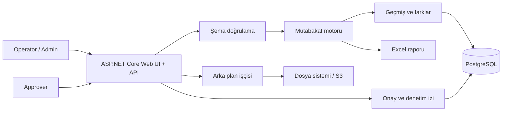

# Banka Mutabakat Platformu

[](https://github.com/Muhametaydn/BankingReconciliation/actions/workflows/ci.yml)

[English](README.md) | [Türkçe](README.tr.md)

Şube ve banka hareketlerini karşılaştıran, farkları incelemeyi ve onay kararlarını
denetlenebilir biçimde kaydetmeyi sağlayan .NET 8 tabanlı mutabakat platformu.

Bu proje, temel bir CRUD uygulamasının ötesinde; yapılandırılabilir doğrulama,
rol bazlı iş akışları, asenkron işleme, kalıcı veri, güvenlik kontrolleri ve
dağıtım otomasyonu göstermek amacıyla geliştirilmiştir.

## Öne Çıkanlar

- CSV, ayrılmış TXT, sabit genişlikli TXT ve yapılandırılmış veritabanı
  kaynaklarından mutabakat yapar.
- Eksik hareketleri, tekrarlı anahtarları, adet/tutar uyumsuzluklarını ve
  yapılandırılabilir sayısal alan farklarını tespit eder.
- Dosya şemasını, eşleştirme anahtarlarını, karşılaştırma alanlarını, değer
  eşlemelerini ve sonuç alanlarını çalışma anında doğrular ve günceller.
- **Administrator**, **Operator** ve **Approver** rollerini JWT tabanlı yerel
  kimlik doğrulama ile yönetir.
- Tamamlanan mutabakatlar için Approver onayı veya reddi gerektirir; kararlar
  denetim kaydına alınır.
- Geçmiş, farklar, ayarlar, kararlar ve denetim olaylarını PostgreSQL’de tutar.
- Büyük işlemleri yeniden denemeli ve kiralama tabanlı arka plan işleri olarak
  çalıştırır.
- Farkları Excel’e aktarır; geçmiş kayıtlarını filtreleme ve sayfalama ile sunar.
- Yerel dosya sistemi, paylaşımlı dosya sistemi, AWS S3 uyumlu depolama ve MinIO
  senaryolarını destekler.
- Docker, Kubernetes, OpenTelemetry, güvenlik başlıkları, oran sınırlama ve
  dağıtım doğrulama araçlarını içerir.

## Mimari



## Teknolojiler

| Alan | Teknolojiler |
| --- | --- |
| Backend | .NET 8, ASP.NET Core Minimal API, EF Core |
| Veri | PostgreSQL, Npgsql, EF Core migration |
| Güvenlik | JWT, rol/izin politikaları, denetim kaydı, oran sınırlama, güvenlik başlıkları |
| Depolama | Yerel/paylaşımlı dosya sistemi, AWS S3 uyumlu depolama, MinIO |
| Operasyon | Docker, Kubernetes, OpenTelemetry, PowerShell dağıtım/doğrulama betikleri |
| Kalite | xUnit, GitHub Actions, kod biçim kontrolü, entegrasyon test profilleri |

## Yerelde Çalıştırma

Ön koşul: .NET SDK 8.

```powershell
git clone https://github.com/Muhametaydn/BankingReconciliation.git
cd BankingReconciliation
dotnet run --project .\BankingReconciliation.Api\BankingReconciliation.Api.csproj
```

Tarayıcıdan `http://localhost:5230` adresini açın.

Boş bir yerel kurulumda **Kayıt ol** ile oluşturulan ilk hesap otomatik olarak
Admin olur. Diğer hesaplar Operator açılır; Admin, bu hesaplara Approver rolünü
verebilir.

Örnek dosyalar:
[`BankingReconciliation.Api/Samples`](BankingReconciliation.Api/Samples)

## Docker ile Çalıştırma

```powershell
docker build -t banking-reconciliation:local .
docker run --rm -p 8080:8080 banking-reconciliation:local
```

Ardından `http://localhost:8080` adresini açın.

## Doğrulama

```powershell
dotnet test .\BankingReconciliation.sln --configuration Release
dotnet format .\BankingReconciliation.sln --verify-no-changes --no-restore
```

## Yerel Kubernetes Profili

Docker Desktop Kubernetes kullanıyorsanız:

```powershell
.\deploy\kubernetes\deploy-local.ps1
```

Bu profil yalnızca geliştirme amaçlıdır. Kullanıcılar ve yüklenen dosyalar yerel
kalıcı disk alanında tutulur; uygulama pod’u yeniden başlasa da korunur.

## Dağıtım ve Üretim Hazırlığı

Kubernetes dağıtımı, yedekleme, geri dönüş ve staging doğrulama adımları için
[Kubernetes çalışma rehberine](deploy/kubernetes/README.md) bakın.

Gerçek üretim ortamında gerekli olan bulut kimliği, gizli anahtarlar, canlı
veritabanı ve onay süreçleri
[PRODUCTION_READINESS.md](PRODUCTION_READINESS.md) dosyasında ayrıca takip
edilir. Bu ortam kaynakları yerelde tamamlandı olarak gösterilmez.

## Ayrıntılı Teknik Referans

Tüm endpoint, dosya formatı, yapılandırma, test ve altyapı ayrıntıları için
[İngilizce teknik referansa](README.md#detailed-technical-reference) bakın.
