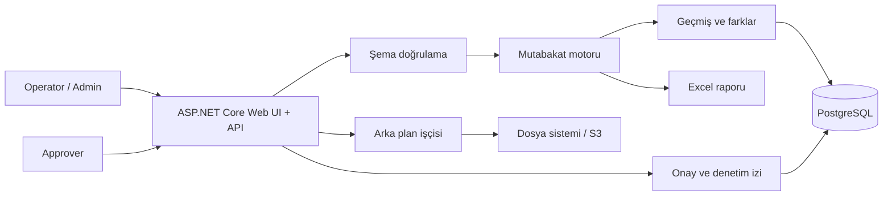

# Banka Mutabakat Platformu

[](https://github.com/Muhametaydn/BankingReconciliation/actions/workflows/ci.yml)

[English](README.md) | [Türkçe](README.tr.md)

Şube ve banka hareketlerini karşılaştıran, farkları incelemeyi ve onay kararlarını
denetlenebilir biçimde kaydetmeyi sağlayan .NET 8 tabanlı mutabakat platformu.

Bu proje, temel bir CRUD uygulamasının ötesinde; yapılandırılabilir doğrulama,
rol bazlı iş akışları, asenkron işleme, kalıcı veri, güvenlik kontrolleri ve
dağıtım otomasyonu göstermek amacıyla geliştirilmiştir.

## Öne Çıkanlar

- CSV, ayrılmış TXT, sabit genişlikli TXT ve yapılandırılmış veritabanı
  kaynaklarından mutabakat yapar.
- Eksik hareketleri, tekrarlı anahtarları, adet/tutar uyumsuzluklarını ve
  yapılandırılabilir sayısal alan farklarını tespit eder.
- Dosya şemasını, eşleştirme anahtarlarını, karşılaştırma alanlarını, değer
  eşlemelerini ve sonuç alanlarını çalışma anında doğrular ve günceller.
- **Administrator**, **Operator** ve **Approver** rollerini JWT tabanlı yerel
  kimlik doğrulama ile yönetir.
- Tamamlanan mutabakatlar için Approver onayı veya reddi gerektirir; kararlar
  denetim kaydına alınır.
- Geçmiş, farklar, ayarlar, kararlar ve denetim olaylarını PostgreSQL’de tutar.
- Büyük işlemleri yeniden denemeli ve kiralama tabanlı arka plan işleri olarak
  çalıştırır.
- Farkları Excel’e aktarır; geçmiş kayıtlarını filtreleme ve sayfalama ile sunar.
- Yerel dosya sistemi, paylaşımlı dosya sistemi, AWS S3 uyumlu depolama ve MinIO
  senaryolarını destekler.
- Docker, Kubernetes, OpenTelemetry, güvenlik başlıkları, oran sınırlama ve
  dağıtım doğrulama araçlarını içerir.

## Mimari



## Teknolojiler

| Alan | Teknolojiler |
| --- | --- |
| Backend | .NET 8, ASP.NET Core Minimal API, EF Core |
| Veri | PostgreSQL, Npgsql, EF Core migration |
| Güvenlik | JWT, rol/izin politikaları, denetim kaydı, oran sınırlama, güvenlik başlıkları |
| Depolama | Yerel/paylaşımlı dosya sistemi, AWS S3 uyumlu depolama, MinIO |
| Operasyon | Docker, Kubernetes, OpenTelemetry, PowerShell dağıtım/doğrulama betikleri |
| Kalite | xUnit, GitHub Actions, kod biçim kontrolü, entegrasyon test profilleri |

## Yerelde Çalıştırma

Ön koşul: .NET SDK 8.

```powershell
git clone https://github.com/Muhametaydn/BankingReconciliation.git
cd BankingReconciliation
dotnet run --project .\BankingReconciliation.Api\BankingReconciliation.Api.csproj
```

Tarayıcıdan `http://localhost:5230` adresini açın.

Boş bir yerel kurulumda **Kayıt ol** ile oluşturulan ilk hesap otomatik olarak
Admin olur. Diğer hesaplar Operator açılır; Admin, bu hesaplara Approver rolünü
verebilir.

Örnek dosyalar:
[`BankingReconciliation.Api/Samples`](BankingReconciliation.Api/Samples)

## Docker ile Çalıştırma

```powershell
docker build -t banking-reconciliation:local .
docker run --rm -p 8080:8080 banking-reconciliation:local
```

Ardından `http://localhost:8080` adresini açın.

## Doğrulama

```powershell
dotnet test .\BankingReconciliation.sln --configuration Release
dotnet format .\BankingReconciliation.sln --verify-no-changes --no-restore
```

## Yerel Kubernetes Profili

Docker Desktop Kubernetes kullanıyorsanız:

```powershell
.\deploy\kubernetes\deploy-local.ps1
```

Bu profil yalnızca geliştirme amaçlıdır. Kullanıcılar ve yüklenen dosyalar yerel
kalıcı disk alanında tutulur; uygulama pod’u yeniden başlasa da korunur.

## Dağıtım ve Üretim Hazırlığı

Kubernetes dağıtımı, yedekleme, geri dönüş ve staging doğrulama adımları için
[Kubernetes çalışma rehberine](deploy/kubernetes/README.md) bakın.

Gerçek üretim ortamında gerekli olan bulut kimliği, gizli anahtarlar, canlı
veritabanı ve onay süreçleri
[PRODUCTION_READINESS.md](PRODUCTION_READINESS.md) dosyasında ayrıca takip
edilir. Bu ortam kaynakları yerelde tamamlandı olarak gösterilmez.

## Ayrıntılı Teknik Referans

### Dosya formatı ve doğrulama

Varsayılan dosya şeması aşağıdaki alanları kullanır:

```csv
BranchCode,FundCode,TransactionNumber,TransactionDate,Quantity,Amount
BEYLIKDUZU,A,TX001,2026-06-26,100,10000
```

- Ayırıcı olarak virgül, `|` veya sekme kullanılabilir.
- `TransactionDate`, `yyyy-MM-dd` formatında olmalıdır.
- `Quantity` ve `Amount` ondalık değer olmalıdır.
- Hatalı satırlar için satır ve biliniyorsa kolon bilgisi döner.
- Şema ek alanları; regex, izinli değer, uzunluk, aralık ve ondalık basamak
  kurallarını destekler.

Varsayılan eşleştirme anahtarı `BranchCode + FundCode + TransactionNumber`dır.
Eşleştirme alanları, karşılaştırılacak sayısal alanlar ve değer eşlemeleri
yönetim ekranından veya yapılandırmadan değiştirilebilir.

### Mutabakat sonuçları

| Sonuç | Açıklama |
| --- | --- |
| `Matched` | İki kayıtta da bulunan ve karşılaştırma alanları eşit olan işlem |
| `OnlyInBranch` | Yalnızca şube/kaynak dosyasında bulunan işlem |
| `OnlyInBank` | Yalnızca banka dosyasında bulunan işlem |
| `QuantityMismatch` / `AmountMismatch` | Adet veya tutar farkı bulunan işlem |
| `QuantityAndAmountMismatch` | Hem adet hem tutar farkı bulunan işlem |
| `FieldMismatch` | Ek yapılandırılmış sayısal alanlarda fark bulunan işlem |

Farklı kayıtlar filtrelenebilir, geçmişte aranabilir ve Excel formatında
indirilebilir. Eşleşen satırlar fark raporuna dahil edilmez.

### Kimlik doğrulama ve roller

Yerel geliştirme akışı JWT tabanlıdır. İlk kayıt olan hesap **Administrator**
olur; sonraki kayıtlar **Operator** olarak açılır.

| Rol | Yetki |
| --- | --- |
| Administrator | Kullanıcı rolleri, şema, karşılaştırma ayarları, kaynaklar ve denetim kayıtları |
| Operator | Dosya/veritabanı mutabakatı başlatma ve sonuçları inceleme |
| Approver | Tamamlanmış bir mutabakatı onaylama veya gerekçeyle reddetme |

Onay veya ret kararında karar veren kullanıcı, UTC zaman bilgisi ve açıklama
saklanır. Yönetim işlemleri ve onay kararları denetim izine yazılır.

### Önemli API uçları

| İşlem | Endpoint |
| --- | --- |
| Dosyaları doğrudan karşılaştır | `POST /api/reconciliations/compare` |
| Dosya işi kuyruğa al | `POST /api/reconciliations/compare/jobs` |
| Veritabanı kaynaklarını karşılaştır | `POST /api/reconciliations/compare-database-sources` |
| Geçmişi listele | `GET /api/reconciliations` |
| Batch ayrıntısını getir | `GET /api/reconciliations/{id}` |
| Fark raporunu indir | `GET /api/reconciliations/{id}/export` |
| Onay/red kararı ver | `POST /api/reconciliations/{id}/approval` |
| Dosya şemasını getir/güncelle | `GET` / `PUT /api/reconciliation-file-schema` |
| Karşılaştırma ayarlarını getir/güncelle | `GET` / `PUT /api/reconciliation-comparison-settings` |
| Denetim olaylarını getir | `GET /api/reconciliation-audit-events` |

Swagger yerel çalıştırmada `http://localhost:5230/swagger` adresindedir.

### Kalıcılık, kuyruk ve depolama

PostgreSQL bağlantısı tanımlandığında batch özeti, fark kayıtları, kaynaklar,
ayarlar, onaylar ve denetim olayları kalıcı olarak saklanır. Bağlantı yoksa
geliştirme için bellek içi alternatif kullanılır.

Uzun sürebilecek işlemler kuyrukta çalıştırılır. İşçi, PostgreSQL üzerinde
süreli kira alır; uygulama yeniden başladığında uygun işleri kurtarır ve geçici
hataları yapılandırılmış deneme sayısına kadar yeniden dener. Geçmiş ekranında
`Queued`, `Processing`, `Completed` ve `Failed` durumları görünür.

Yüklenen arka plan dosyaları rastgele batch kimliğiyle saklanır. `Local`,
`SharedFileSystem` ve AWS S3/MinIO için `S3Compatible` depolama modları
desteklenir. S3 modunda boyut sınırı, checksum, sunucu tarafı şifreleme ve
güvenli temizleme desteği bulunur.

### Yapılandırma ve gözlemlenebilirlik

Uygulama ayarları `appsettings.json` üzerinden; üretimde ise ortam değişkenleri
ve gizli yönetim sistemi üzerinden alınmalıdır. Parola, connection string, JWT
imzalama anahtarı ve bulut erişim anahtarları Git’e eklenmemelidir.

Sık kullanılan ayar bölümleri:

```text
ConnectionStrings:ReconciliationDatabase
Authentication
ReconciliationFileSchema
ReconciliationComparison
ReconciliationUpload
ReconciliationJobs
ReconciliationImmutableAuditArchive
```

- `GET /api/health` uygulama sürecini doğrular.
- `GET /api/health/ready` veritabanı ve depolama erişimini doğrular.
- OpenTelemetry OTLP dışa aktarımı yapılandırmayla etkinleştirilebilir.
- Güvenlik başlıkları ve IP tabanlı oran sınırlama aktiftir.

### Test, CI ve dağıtım

Test paketi parser, mutabakat motoru, endpointler, veritabanı depoları,
yetkilendirme, frontend varlıkları ve altyapı sözleşmelerini kapsar. GitHub
Actions her `main` gönderiminde ve pull request’te paket geri yükleme, biçim
kontrolü, Release derlemesi ve tüm testleri çalıştırır.

`deploy/kubernetes` altında yerel Docker Desktop profili, staging ön kontrolü,
dağıtım, geri alma, yedekleme ve geri yükleme doğrulama betikleri bulunur.
Gerçek üretim ortamı için kimlik sağlayıcısı, gizli yönetimi, HTTPS alan adı,
bulut depolama/KMS, canlı PostgreSQL ve operasyon onayları gerekir. Bu maddeler
[PRODUCTION_READINESS.md](PRODUCTION_READINESS.md) içinde açık biçimde takip
edilir; yerel doğrulama üretim kabulü olarak sunulmaz.
